### 🚀 *DevOps Engineer | Cloud Engineer | Linux Engineer*

🌐 Passionate about automating, monitoring, and optimizing infrastructure.
☁️ Skilled in AWS, CI/CD pipelines, Linux systems, containerization, and IaC.
⚙️ I love building reliable, scalable, production-ready systems.

---

## ♾️ DevOps Infinity Loop

---

## $${\color{#FF9800} \textbf{🔧 \ Tools}}$$

| **🐧 Linux** | **🏗️ Terraform** | **⚙️ Jenkins** | **📦 Kubernetes** | **🛠️ Ansible** | **🔄 Git** | **🐳 Docker** | **👨‍💻 GitHub** | **☁️ AWS** | **📜 Bash** | **🌐 Azure** |
|:---------:|:-------------:|:-----------:|:--------------:|:-----------:|:----------:|:-------:|:----------:|:----------:|:----------:|:----------:|
|           |               |             |                |             |            |         |          |        |     |  

---
<picture>
  <source
    media="(prefers-color-scheme: dark)"
    srcset="https://raw.githubusercontent.com/platane/snk/output/github-contribution-grid-snake-dark.svg"
  />
  <source
    media="(prefers-color-scheme: light)"
    srcset="https://raw.githubusercontent.com/platane/snk/output/github-contribution-grid-snake.svg"
  />
  
</picture>

### ☁️ **Cloud Platform**

* 🌩 **AWS**: EC2, VPC, IAM, S3, CloudWatch, Load Balancer, ASG, Lambda, RDS, Cloudfront, AWS-CLI
* **AZURE**
* **GCP**
* 🌍 Cloud Networking & Security Groups
* 🛰 Route53, CloudFront

### 🐧 **Linux Engineering**

* 🖥 Advanced Linux Administration
* 🧩 Shell Scripting (Bash)
* 📂 File systems, ACL, Permissions
* 🧵 Process Management
* 🔍 Monitoring & Logs

---

## 🚀 **What I Will Do**

* Build and maintain CI/CD pipelines
* Manage cloud infrastructure using Terraform
* Automate deployments & configurations
* Containerize applications with Docker
* Work with Kubernetes clusters
* Monitor infrastructure & optimize performance
* Manage and harden Linux servers

---

## 📈 **Current Focus**

* Improving cloud cost optimization
* Learning Git/GitHub, Docker & Kubernetes, Teraform, jenkins 
* Automating everything (because why not 😄)

---

## 📫 **Connect With Me**

* ✉️ Email: sairajn508@gmail.com
* 💼 LinkedIn: Sairaj Naik.

